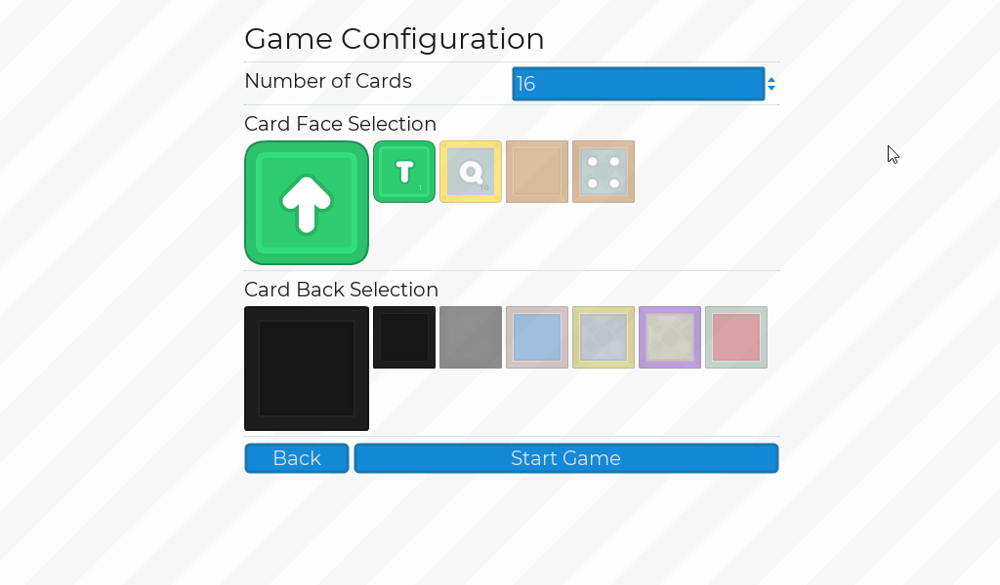
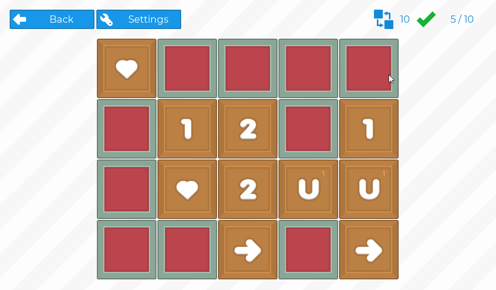
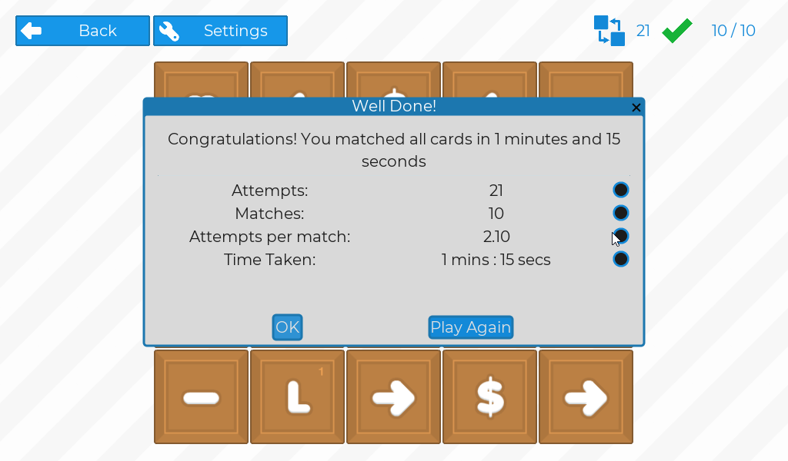

# Memory Match

A simple memory game where you must remember where pairs of cards are located on a grid and flip them to match!

Play here: https://iameric.itch.io/memory-match

A quick demo video [available here](https://streamable.com/3oeitq)!

### Key Features

- Grid based card game.
- Customization options for number of cards (up to 120 - i.e. 60 matches) and textures on front and back of cards
- Game timing and some basic stats (guesses per match)
- Basic options menu

### Most Intersting Files

There are what I think to be the most interesting files in this project. They contain a fair bit of the main logic and things that might interest users.

- [card_grid/grid.gd](card_grid/grid.gd): Container for the cards. Contains logic for initialising the cards and creating the pairs.
- [card_grid/grid_state.gd](card_grid/grid_state.gd): Keeps the game state. How many tries, how many matches, start and end times, etc. This controls the game flow.
- [autoload/game_configuration.gd](autoload/game_configuration.gd): Controls how the game should be configured. Stores the available texture sets for the faces and the backs of the cards. Is also used to calculate the size of the grid required, and the dimensions for a given number of cards. Ensures that a nice grid can be made from the number of cards selected.

Of course, you can download the project and run it yourself to fully explore how it works!

### Screenshots

#### Developed in Godot 3.2
